# 5. 详细设计与实现

## 5.1 视频流管理模块

### 5.1.1 视频流管理模块流程设计

图5-1 视频流管理模块流程图

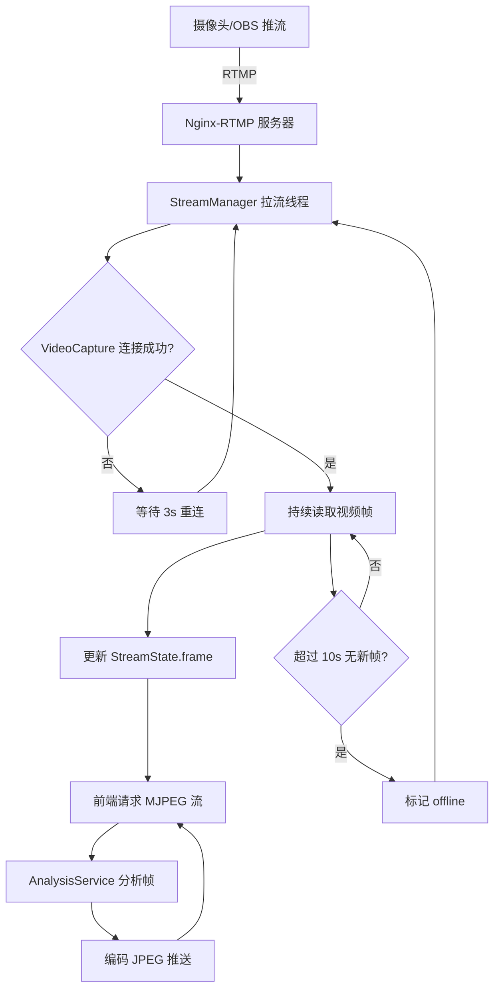

### 5.1.2 视频流管理模块类设计

图5-2 视频流管理模块类图

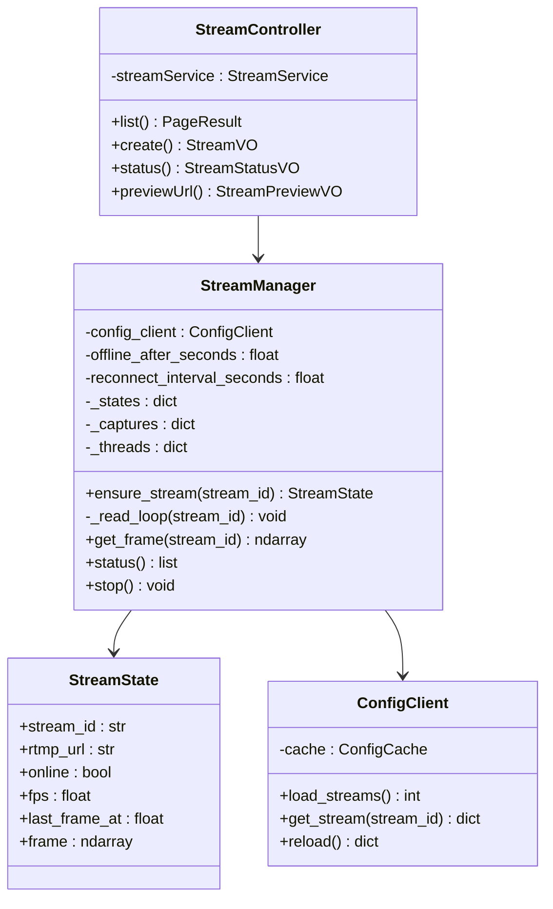

### 5.1.3 视频流管理模块时序设计

图5-3 视频流管理模块时序图

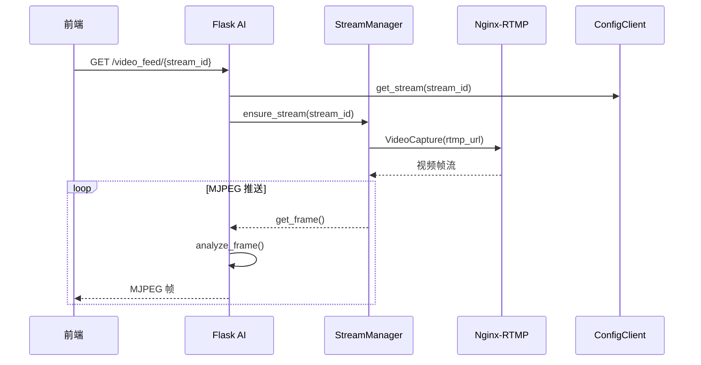

图5-4 实现后的主要界面

（界面截图待补充）

## 5.2 人脸识别模块

### 5.2.1 人脸识别模块流程设计

图5-5 人脸识别模块流程图

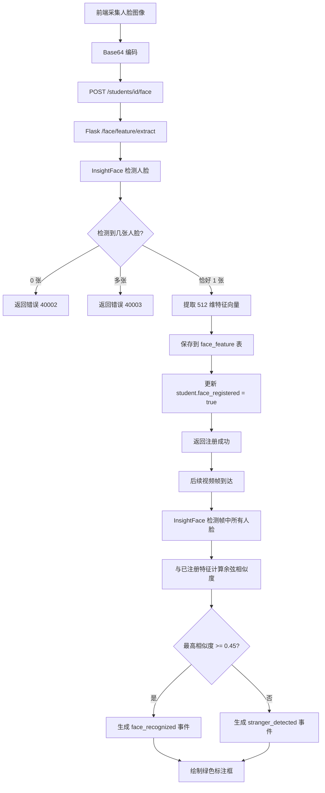

### 5.2.2 人脸识别模块类设计

图5-6 人脸识别模块类图

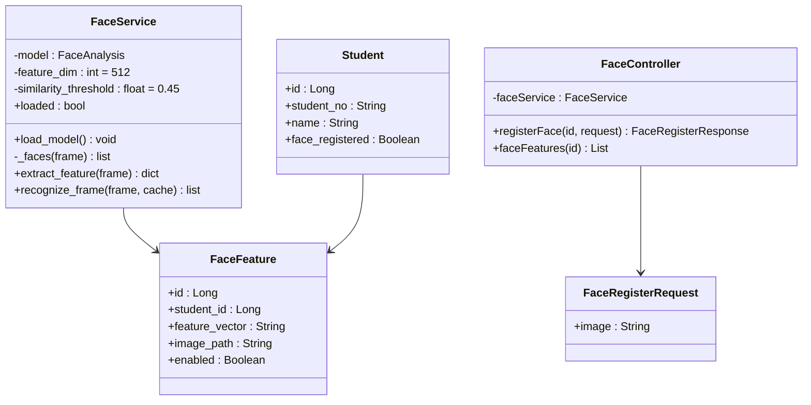

### 5.2.3 人脸识别模块时序设计

图5-7 人脸识别模块时序图

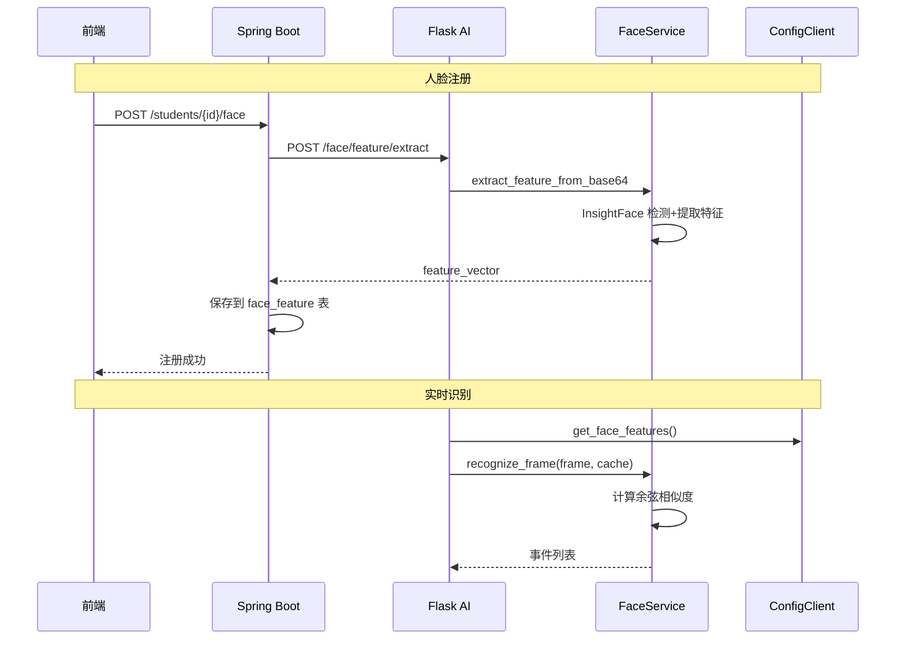

图5-8 实现后的主要界面

（界面截图待补充）

## 5.3 目标检测与区域入侵模块

### 5.3.1 目标检测与区域入侵模块流程设计

图5-9 目标检测与区域入侵模块流程图

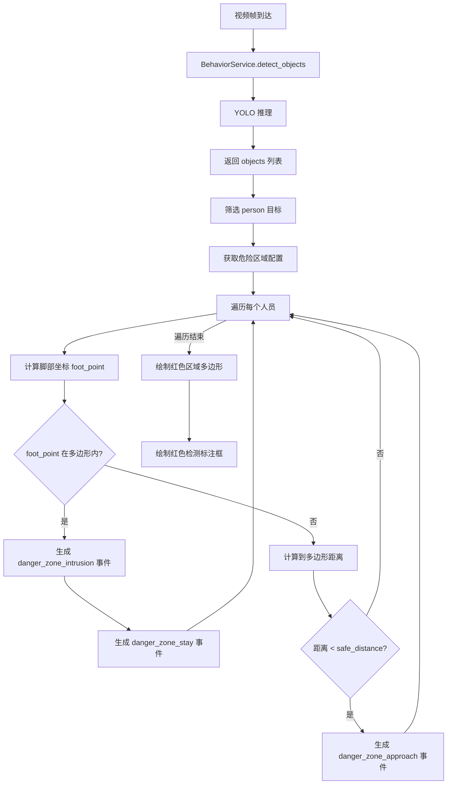

### 5.3.2 目标检测与区域入侵模块类设计

图5-10 目标检测与区域入侵模块类图

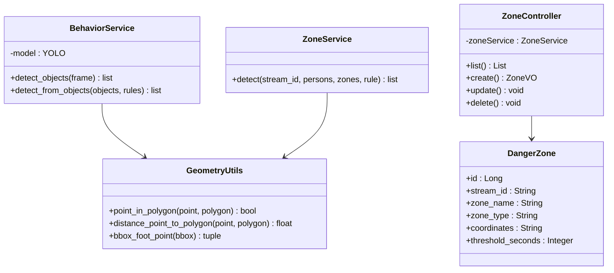

### 5.3.3 目标检测与区域入侵模块时序设计

图5-11 目标检测与区域入侵模块时序图

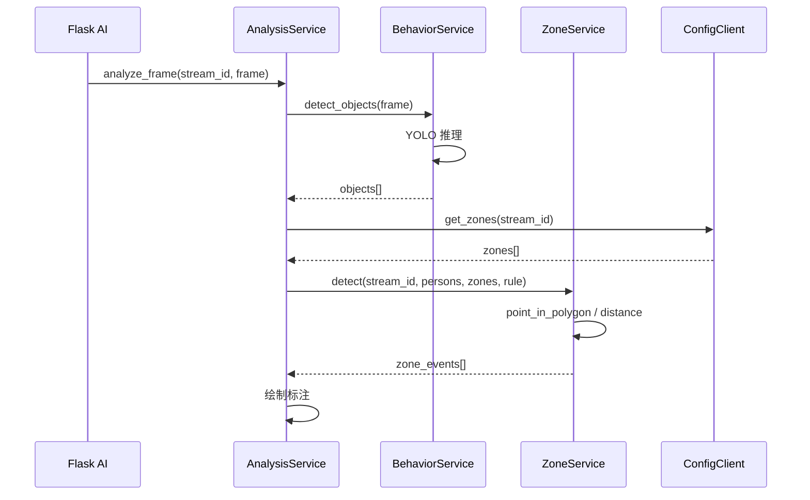

图5-12 实现后的主要界面

（界面截图待补充）

## 5.4 异常行为检测模块

### 5.4.1 异常行为检测模块流程设计

图5-13 异常行为检测模块流程图

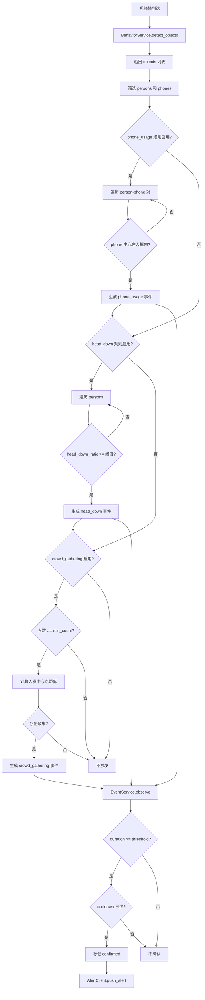

### 5.4.2 异常行为检测模块类设计

图5-14 异常行为检测模块类图

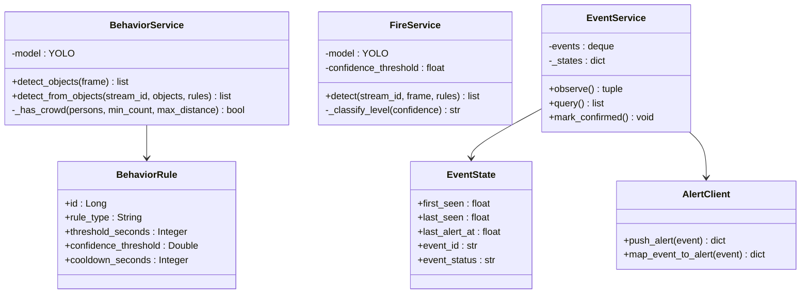

### 5.4.3 异常行为检测模块时序设计

图5-15 异常行为检测模块时序图

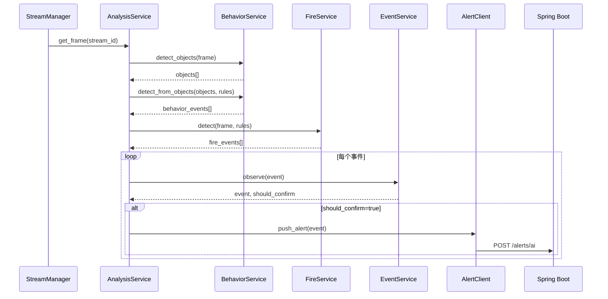

图5-16 实现后的主要界面

（界面截图待补充）

## 5.5 告警管理模块

### 5.5.1 告警管理模块流程设计

图5-17 告警管理模块流程图

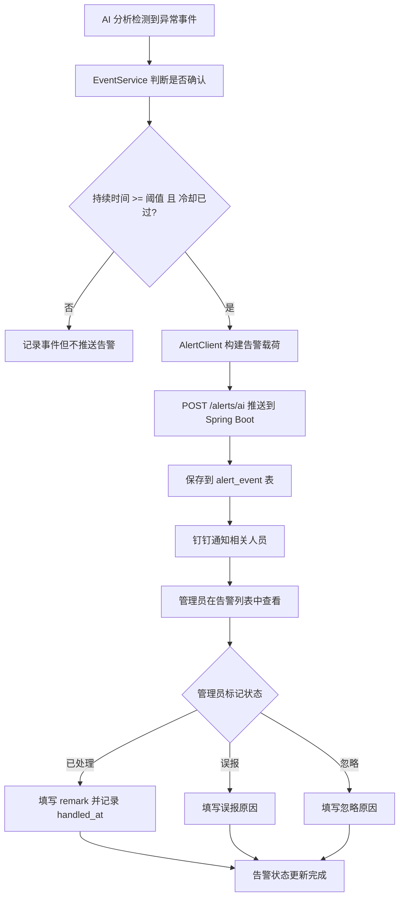

### 5.5.2 告警管理模块类设计

图5-18 告警管理模块类图

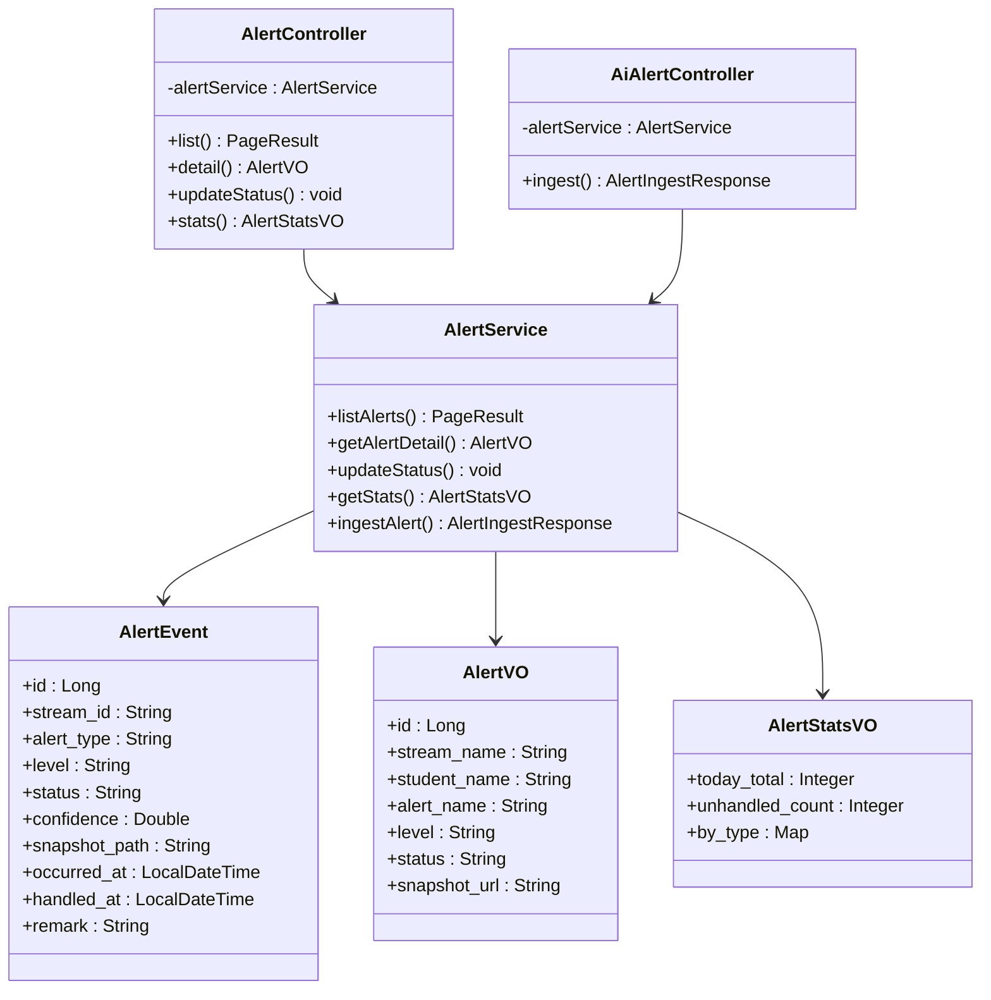

### 5.5.3 告警管理模块时序设计

图5-19 告警管理模块时序图

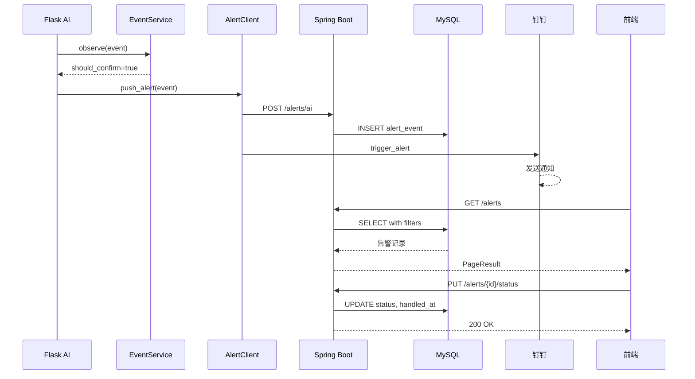

图5-20 实现后的主要界面

（界面截图待补充）
